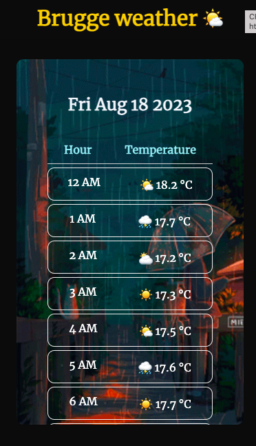

# Weather forecast

> A simple screen showing the weather for the upcoming hours

## Table of contents

- [Weather forecast](#weather-forecast)
  - [Table of contents](#table-of-contents)
  - [General info](#general-info)
  - [Screenshots](#screenshots)
  - [Technologies](#technologies)
  - [Setup](#setup)
  - [Code Examples](#code-examples)
  - [Features](#features)
  - [Status](#status)

## General info

> The objective of the project is to practice separation of concern in
> JavaScript.

## Screenshots



## Technologies

- JavaScript
- HTML5
- CSS3
- VSC code

## Setup

clone the repo and start using the stop watch.

## Code Examples

```js
const fetchWeather = async () => {
  try {
    const response = await fetch(data.weatherURL);
    if (response.ok) {
      const weatherData = await response.json();
     return weatherData
    } else {
      throw new Error('Error occurred while fetching weather');
    }
  } catch (error) {
    console.error(error);
  }
};

export default fetchWeather;
```

## Features

List of features ready and Todos for future development

- Weather forecast for the next 12 hours in Brugge city

To-do list:

- Implement search bar for cities
- Present weather for more days

## Status

Project is: _Completed_
